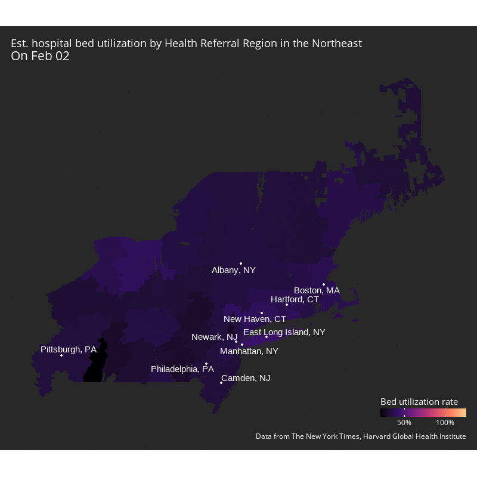

# COVID-19

There is no shortage of great data visualizations to help us understand the ongoing pandemic, but there are also always more angles to explore. And while I have only a basic understanding of this topic, based mostly on articles from major US new outlets, I think experts and the interested public can certainly benefit from new takes, even if rough or incomplete. To that end, I thought I'd try to contribute in my own small way.

As an avid consumer of data viz, I found the case/death trackers (e.g. the [dashboard](https://www.nytimes.com/interactive/2020/us/coronavirus-us-cases.html) pulbished by the New York Times) informative and well communicated, but lacking the crucial bit of context of when a given geographic area is reaching its limits. My first take on a new perspective to tracking the progression of the virus attempts to frame the data in terms of what public health experts seem to be most concerned about: a shortage a hospital resources at any given point in time.

This is of course a multi-facetted concern, ranging from hospital staffing and budgeting, to personal protective equiment, to physical space and equipment avaialable. ProPublica published an interesting [article](https://projects.propublica.org/graphics/covid-hospitals) on the latter topic using hospital capacity [data](https://globalepidemics.org/our-data/hospital-capacity/) compiled by the Harvard Global Health Institute. It's a scenario analysis of where the the virus could put outsized strain on a given "Hospital Referral Region" (each of which provides health care for ~65% of the population within its boundries). The possibile outcomes are wide ranging, though, and it's not clear which case is the most likely. But, combined with up-to-date tracking [data](https://github.com/nytimes/covid-19-data) compiled by the NYT, the trajectory of the situation comes more into focus and "true" hotspots (where resources are really strained) are easier to identify.

Here _hospital bed utilization_ is defined as _(estimated hospital beds occupied prior to COVID-19 + beds added daily due to COVID-19 - beds no longer needed after average length of stay) / total beds in an HRR region_ where beds needed due to COVID-19 assumes 20% hospitalization of cases and a 12 day stay (both taken from HGHI). To be clear, these are very much estimates. Even the number of beds available prior to the pandemic is rough and optimistic in the sense that it assumes the half the beds used could be freed up for the surge. Additionally, counties don't always fit neatly within HRR regions so cases are apportioned based on area overlap. Nevertheless, I find the resulting graph to be useful in terms identifying patterns and trends with context.

This is an ongoing project that I'm sure will improve over time, but I hope it's at an least interesting approach to an important topic. Please let me know if there are any concerns with the accuracy of the data or how it's being presented. Thanks!
